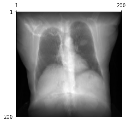

# DiffDRR

DiffDRR is a PyTorch-based DRR generator that provides

1. Auto-differentiable DRR syntheisis
2. GPU-accelerated rendering
3. A pure Python implementation

DiffDRR implements DRR synthesis as a PyTorch module, making it interoperable in deep learning pipelines.

## Installation

```
git clone https://github.com/v715/DiffDRR
conda env create -f environment.yaml
conda activate DiffDRR
```

## Usage

The following minimal example specifies the geometry of the projectional radiograph imaging system and traces rays through a CT volume.

```Python
import matplotlib.pyplot as plt
import numpy as np

from src import DRR, load_example_ct
from src.visualization import plot_drr

# Read in the volume
volume, spacing = load_example_ct()

# Get parameters for the detector
bx, by, bz = np.array(volume.shape) * np.array(spacing) / 2
detector_kwargs = {
    "sdr"   : 300.0,
    "theta" : np.pi,
    "phi"   : 0,
    "gamma" : np.pi / 2,
    "bx"    : bx,
    "by"    : by,
    "bz"    : bz,
}

# Make the DRR
drr = DRR(volume, spacing, height=200, delx=1.4e-2, device="cuda")
img = drr(**detector_kwargs)

ax = plot_drr(img)
plt.show()
```

which produces the following image



The full example is available at [`notebooks/example_drrs.ipynb`](notebooks/example_drrs.ipynb).

## Application: 6-DoF Slice-to-Volume Registration

We demonstrate the utility of our auto-differentiable DRR generator by solving a 6-DoF registration problem with gradient-based optimization.
Here, we generate two DRRs:

1. A fixed DRR from a set of ground truth parameters
2. A moving DRR from randomly initialized parameters

To solve the registration problem, we use gradient descent to minimize an image loss similarity metric between the two DRRs.
This produces optimization runs like this


The full example is available at [`experiments/registration`](experiments/registration).

## How does DiffDRR work?

DiffDRR reformulates Siddon's method,[^fn] the canonical algorithm for calculating the radiologic path of an X-ray through a volume, as a series of vectorized tensor operations.
This version of the algorithm is easily implemented in tensor algebra libraries like PyTorch to achieve a fast auto-differentiable DRR generator.

[^fn]: [Fast calculation of the exact radiological path for a three-dimensional CT array, Robert L. Siddon, 1985](https://aapm.onlinelibrary.wiley.com/doi/abs/10.1118/1.595715)
